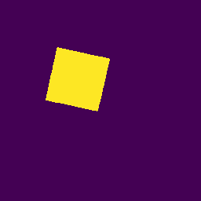

# EIT Image Reconstruction Algorithm
This is a submission for the [Kuopio Tomography Challenge](https://www.fips.fi/KTC2023.php). 

## Authors
- Amal Mohammed A Alghamdi (DTU), Denmark
- Martin Sæbye Carøe (DTU), Denmark
- Jasper Marijn Everink (DTU), Denmark
- Jakob Sauer Jørgensen (DTU), Denmark
- Kim Knudsen (DTU), Denmark
- Jakob Tore Kammeyer Nielsen (DTU), Denmark
- Aksel Kaastrup Rasmussen (DTU), Denmark
- Rasmus Kleist Hørlyck Sørensen (DTU), Denmark
- Chao Zhang (DTU), Denmark

## Addresses
DTU: Technical University of Denmark, Department of Applied Mathematics and Computer Science Richard Petersens Plads Building 324 2800 Kgs. Lyngby Denmark

## Description of the algorithm

We built a complete electrode model CEM by extending the model provided in [the linked BSc. thesis](https://fulltext-gateway.cvt.dk/oafilestore?oid=575ea38fe6f951534a00c2e0&targetid=56d754b8bf19455102000781). We also built the framework to solve a nonlinear optimization problem of inferring the conductivity $\sigma$ using a least-square optimization approach. We added three regularization terms. One is TV, based on [the linked tutorial](https://uvilla.github.io/cmis_labs/notebooks/ImageDenoising_TV.html). The second one is Tikhonov, based on the regularization class `SMPrior` provided by the competition. The third regularization term is a generalized Tikhonov regularization that penalizes more when close to the missing electrodes (and boundary). We used `scipy` L-BFGS-B to solve the optimization problem and segment with Chan-Vese segmentation method from `scikit-image`. Our implementation uses `FEniCS`, a finite element method library.


## Installation instructions
To run our EIT image reconstruction algorithm, you will need:

- Python 3.x
- Required Python libraries (listed in `requirements.txt`)
- Access to the provided dataset (not included in this repository)

Note that you will need to install `FEniCS 2019.1.0.` One way to do it is to follow Anaconda installation instructions in this [link](https://fenicsproject.org/download/archive/). 

## Usage instructions

```
python main.py path/to/input/files path/to/output/files difficulty
```

## Examples
|  Phantom 	|  Ref	| Level 1 	| Level 4 	| Level 7 	|
|----------	|-----	|---	|---	|---	|
|**a**| 	| 	|   	|   	|   
|**b**| 	| 	|   	|   	|
|**c**| 	| 	|   	|   	|
|**d**| 	| 	|   	|   	|  

Scores for each phantom and difficulty 1,4 and 7:

|   Phantom	| Level 1 	| Level 4 	| Level 7 	|
|-----	|---	|---	|---	|
|**a**|0.705|0.664|0.254
|**b**|0.786|0.249|0.419
|**c**|0.720|0.157|0.095
|**d**|0.697|0.782|0.755


Scores have been computed using our own implementation of the scoring function based on scikit learn.

## License
All files in the repository come with the [Apache-v2.0](https://www.apache.org/licenses/LICENSE-2.0) license unless differently specified.
